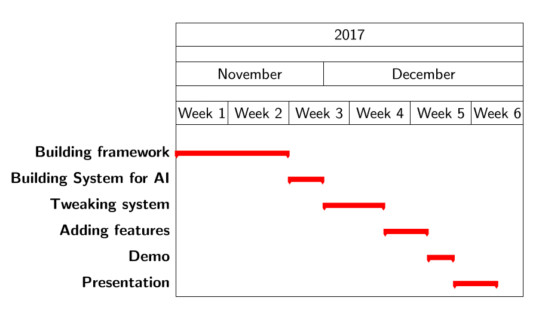

# Journal

## python fuzzy logic connect-4 agent

### distribution of tasks

Harm: nothing
Kaj: get better
Stijn: everything

### planning/schedule

 </img>

### Logs

#### first beginnings

Set up 4opeenrij.py and other players from a hobby project of this summer

#### 12/11/2017

- cleaned up code 
- made github own repository

#### 13/11/2017

- Found out connect-4 is solved for the standard board -> probably better that we used different board
- made pitch presentation

#### 14/11/2017

- had pitch presentation, seemed like an succes
- shared github repository
- idea came to play to automatically create rules, not manually

#### 17/11/2017

- setup for a fuzzy player made

#### 21/11/2017

- Integrated homework assignment with already existing plan for fuzzy agent
- Created the fis-file to python object structure converter
- Found out that fuzzy logic agent is deterministic -> probably good candidate for dynamic programming and cashe memory. Also against the neural network player and brute force player only one game needs to be played, because they are deterministic too. MonteCarlos still needs to play a lot of games to get a good estimate.

#### 22/11/2017

- created first fuzzy automatic rulemaker
- cleaned up filesystem

#### 23/11/2017 - 09/12/2017

- groupmate Harm dropped out.
- groupmate Kaj got sick, work slowed down and stopped in awaiting for kaj

#### 09/12/2017

- Kaj dropped out too. Consequently lost 2 weeks worth of working time

#### 10/12/2017

- Resumed work alone
- Implemented wang/mendel rule learning
- Made the plan to also learn the memberships

#### 11/12/2017

- created a datasetgenerator
- created a judge for dataentries based on the already existing brute force (3 turns) player

#### 12/12/2017

- spoke with TA about what are wise and realistic goals
- evaluated how to implement goals in already existing structure
- probably have to abandon the fis file converter now that i am gonna learn everything from data
- made data representation to start learning memberships
- made milestone2 report

#### 13/12/2017

- working on datalearning

#### 14/12/2017

- working on datalearning

#### 15/12/2017

- Spoke to ta again: reccomended adding features and projecting data on one axis -> started implementing

#### 16/12/2017

- finished membership and rule learning
- manual adjustments 
- first working version -> way too late to still perfectionize it
- gaussians seem not to work -> manually enlarged sigma's -> bugfix

#### 17/12/2017

- final tests agent
- still not good enough
- first paragraph paper

#### 18/12/2017

- started writing paper
- finilized fuzzy agent -> not what i hoped for, but no time to improve anymore
- letting fuzzy agent play its opponents

#### 19/12/2017

- finalize paper
- make presentation

#### 20/12/2017

- presentation
