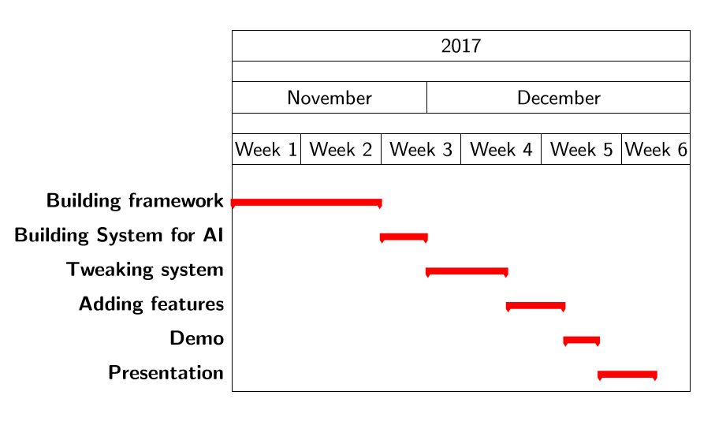

# Journal

## python fuzzy logic connect-4 agent

### distribution of tasks

Kaj: todo
Stijn: todo

### planning/schedule

 </img>

### Logs

#### first beginnings

Set up 4opeenrij.py and other players from a hobby project of this summer

#### 12/11/2017

- cleaned up code 
- made github own repository

#### 13/11/2017

- Found out connect-4 is solved for the standard board -> probably better that we used different board
- made pitch presentation

#### 14/11/2017

- had pitch presentation, seemed like an succes
- shared github repository
- idea came to play to automatically create rules, not manually

#### 17/11/2017

- setup for a fuzzy player made

#### 21/11/2017

- Integrated homework assignment with already existing plan for fuzzy agent
- Created the fis-file to python object structure converter
- Found out that fuzzy logic agent is deterministic -> probably good candidate for dynamic programming and cashe memory. Also against the neural network player and brute force player only one game needs to be played, because they are deterministic too. MonteCarlos still needs to play a lot of games to get a good estimate.

#### 22/11/2017

- created first fuzzy automatic rulemaker
- cleaned up filesystem
